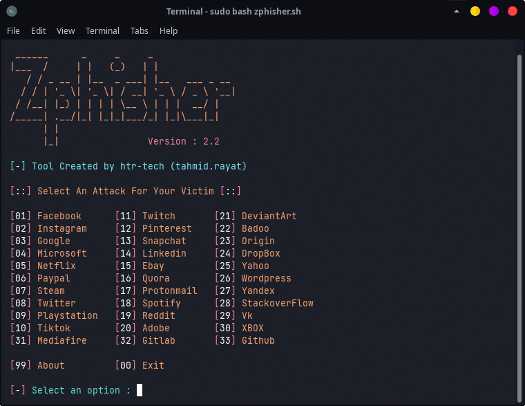

<!-- Zphisher -->

<!-- แสดงโลโก้ของเครื่องมือ Zphisher -->
<p align="center">
  
</p>

<!-- แสดงข้อมูลสถานะต่าง ๆ ของโปรเจค เช่น เวอร์ชั่น, ลิขสิทธิ์, จำนวนดาว, จำนวนปัญหาที่เปิดอยู่ และจำนวนฟอร์ก -->
<p align="center">
  
  
  
  
  
</p>

<!-- แสดงข้อมูลเพิ่มเติมเกี่ยวกับโปรเจค เช่น ผู้เขียน, การเปิดแหล่งที่มา, ความคงทน, และภาษาที่ใช้เขียน -->
<p align="center">
  
  
  
  
  </a>
</p>

<!-- แสดงคำบรรยายโปรเจค -->
<p align="center"><b>A beginners friendly, Automated phishing tool with 30+ templates.</b></p>

<!-- ข้อความคำเตือน (Disclaimer) -->
<h3><p align="center">Disclaimer</p></h3>

<i>
  การกระทำใดๆ ที่เกี่ยวข้องกับ <b>Zphisher</b> เป็นความรับผิดชอบของผู้ใช้เอง การใช้เครื่องมือนี้ในทางที่ผิดอาจทำให้เกิด <b>ข้อกล่าวหาทางอาญา</b> ต่อผู้กระทำผิด <b>ผู้พัฒนาไม่สามารถรับผิดชอบ</b> ในกรณีที่มีข้อกล่าวหาทางอาญาเกิดขึ้นจากการใช้เครื่องมือนี้ในทางที่ผิดกฎหมาย

  <b>เครื่องมือนี้อาจเป็นอันตรายต่อสื่อสังคมออนไลน์</b> ควรตรวจสอบกฎหมายในพื้นที่ของคุณก่อนที่จะใช้งานหรือเข้าถึงเครื่องมือนี้ในทางที่ผิด

  <b>เครื่องมือนี้สร้างขึ้นเพื่อการศึกษาหรือการทดลองเท่านั้น</b> อย่าพยายามใช้เครื่องมือนี้ในทางที่ผิดกฎหมาย <b>หากคุณมีเจตนาเช่นนั้น กรุณาออกจากที่นี้ทันที</b>

  เครื่องมือนี้แสดงวิธีการทำงานของ "ฟิชชิ่ง" เท่านั้น <b>คุณไม่ควรนำข้อมูลไปใช้เพื่อเข้าถึงบัญชีของผู้อื่นโดยไม่ได้รับอนุญาต</b> อย่างไรก็ตาม คุณสามารถทดลองใช้เครื่องมือนี้ได้ด้วยความเสี่ยงของคุณเอง
</i>


##
<!-- ส่วนของฟีเจอร์ (Features) -->
### Features
- หน้าเข้าสู่ระบบล่าสุดและอัพเดต
- ใช้งานง่าย เหมาะสำหรับผู้เริ่มต้น
- มีหลายตัวเลือกสำหรับการสร้างท่อต่อ (Tunneling)
  - Localhost (การใช้งานภายในเครื่อง)
  - Cloudflared (การใช้งานผ่าน Cloudflare)
  - LocalXpose (การใช้งานผ่าน LocalXpose)
- รองรับการซ่อน URL
- รองรับ Docker (สามารถใช้ใน Docker environment ได้)

##

<!-- ส่วนของการติดตั้ง (Installation) -->
### Installation

<!-- การติดตั้งโดยการ clone repository -->
- เพียงแค่ clone repository นี้ -
  ```
  git clone --depth=1 https://github.com/htr-tech/zphisher.git
  ```

- จากนั้นไปที่โฟลเดอร์ที่ clone ไว้และรัน `zphisher.sh` -
  ```
  $ cd zphisher
  $ bash zphisher.sh
  ```
- เมื่อใช้งานครั้งแรก จะติดตั้ง dependencies อัตโนมัติ เพียงเท่านี้ ***Zphisher*** ก็พร้อมใช้งานแล้ว

##

<!-- การติดตั้งใน Termux -->
### Installation (Termux)
คุณสามารถติดตั้ง Zphisher ใน Termux ได้ง่าย ๆ ด้วยคำสั่ง tur-repo
```
$ pkg install tur-repo
$ pkg install zphisher
$ zphisher
```

### หมายเหตุ :
***Termux ไม่สนับสนุนการแฮ็ก*** .. ดังนั้นอย่าพูดคุยเกี่ยวกับ *zphisher* ในกลุ่มการสนทนาใด ๆ ของ Termux หากต้องการข้อมูลเพิ่มเติม : [wiki](https://wiki.termux.com/wiki/Hacking)

##

<!-- ปุ่มสำหรับเปิดใน Google Cloud Shell -->
<p align="left">
  <a href="https://shell.cloud.google.com/cloudshell/open?cloudshell_git_repo=https://github.com/htr-tech/zphisher.git&tutorial=README.md" target="_blank"></a>
</p>

##

##
<!-- การติดตั้งผ่านไฟล์ ".deb" -->
### Installation via ".deb" file

- ดาวน์โหลดไฟล์ `.deb` จาก [**Latest Release**](https://github.com/htr-tech/zphisher/releases/latest)
- หากคุณใช้ ***Termux*** ให้ดาวน์โหลดไฟล์ `*_termux.deb`

- ติดตั้งไฟล์ `.deb` โดยการรันคำสั่ง

  ```
  apt install <your path to deb file>
  ```
  Or
  ```
  $ dpkg -i <your path to deb file>
  $ apt install -f
  ```

##

### การใช้งานบน Docker

- Docker Image Mirror:
- **DockerHub** : 
  ```
  docker pull htrtech/zphisher
  ```
- **GHCR** : 
  ```
  docker pull ghcr.io/htr-tech/zphisher:latest
  ```

- การใช้ wrapper script [**run-docker.sh**](https://raw.githubusercontent.com/htr-tech/zphisher/master/run-docker.sh)

  ```
  $ curl -LO https://raw.githubusercontent.com/htr-tech/zphisher/master/run-docker.sh
  $ bash run-docker.sh
  ```
- Temporary Container

  ```
  docker run --rm -ti htrtech/zphisher
  ```

- อย่าลืมทำการ mount ไดเร็กทอรี `auth`

##

<details>
<summary><h3>Dependencies</h3></summary>

<b>Zphisher</b> ต้องการโปรแกรมดังต่อไปนี้เพื่อการทำงานที่ถูกต้อง - 
- `git`
- `curl`
- `php`

> ทุก dependencies จะถูกติดตั้งอัตโนมัติเมื่อคุณรัน **Zphisher** ครั้งแรก
</details>

<details>
<summary><h3>Tested on</h3></summary>

- **Ubuntu**
- **Debian**
- **Arch**
- **Manjaro**
- **Fedora**
- **Termux**
</details>

##

<h3 align="center"><i>:: Workflow ::</i></h3>
<p align="center">

</p>

##

### คุณสามารถติดตามฉันได้ที่:
<p align="left">
<a href="https://tahmidrayat.is-a.dev" target="_blank"></a>
<a href="https://github.com/htr-tech" target="_blank"></a>
</p>


### *ขอขอบคุณผู้ร่วมพัฒนาทุกท่าน*:

<table>
<tr align="center">
  <td><a href="https://github.com/1RaY-1"><br /><sub><b>1RaY-1</b></sub></a></td>
  <td><a href="https://github.com/adi1090x"><br /><sub><b>Aditya Shakya</b></sub></a></td>
  <td><a href="https://github.com/AliMilani"><br /><sub><b>Ali Milani</b></sub></a></td>
  <td><a href="https://github.com/Meht-evaS"><br /><sub><b>AmnesiA</b></sub></a></td>
  <td><a href="https://github.com/KasRoudra"><br /><sub><b>KasRoudra</b></sub></a></td>
 <td><a href="https://github.com/MoisesTapia"><br /><sub><b>Moises Tapia</b></sub></a></td>
</tr>
<tr align="center">
 <td><a href="https://github.com/E343IO"><br /><sub><b>Mr.Derek</b></sub></a></td>
  <td><a href="https://github.com/BDhackers009"><br /><sub><b>Mustakim Ahmed</b></sub></a></td>
  <td><a href="https://github.com/sepp0"><br /><sub><b>sepp0</b></sub></a></td>
  <td><a href="https://github.com/TripleHat"><br /><sub><b>TripleHat</b></sub></a></td>
  <td><a href="https://github.com/Yisus7u7"><br /><sub><b>Yisus7u7</b></sub></a></td>
</tr>
<table>

<!-- // -->
